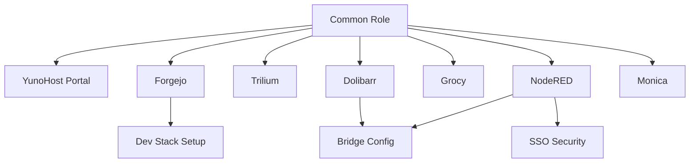

# Smart Bar Cortex Architecture

## Modular Design

The infrastructure is built on **YunoHost 12 (Debian 12)** using a modular Ansible approach.

### Layers

1.  **Hardware/OS Layer**: 
    *   **Alpha**: Physical/Virtual VPS on Hetzner.
    *   **Test**: Ephemeral VMs.
    *   **Network**: Headscale (VPN) Mesh + AdGuard Home (DNS).

2.  **Application Layer (YunoHost Apps)**:
    *   Managed via `yunohost app install` commands wrapped in Ansible.
    *   **Idempotency**: All tasks check `yunohost app list` JSON output before execution.

3.  **Bridge Layer (Integration)**:
    *   **Dolibarr -> Node-RED**: SQL Injection enables `modWebhook` and configures the endpoint.
    *   **Node-RED -> Telegram**: NPM packages installed in user directory.

4.  **Customization Layer**:
    *   **SSOWat (Portal)**: JSON config manipulation + Custom CSS assets.
    *   **Forgejo**: `app.ini` + Public assets folder.
    *   **Node-RED**: `settings.js` replacement.

## Dependency Graph

## Security Model

*   **Public Access**: Restricted by default via YunoHost SSO.
*   **Node-RED API**: Explicitly opened to `visitors` group via `yunohost permission` for webhook reception.
*   **Git**: Private repositories, HTTPS only.

## Access Control & Permissions

We manage permissions via `vars.yml` (`apps.<app>.access`) and the `sso_security` role.

| Access Level | Config `access` | Description |
| :--- | :--- | :--- |
| **Private (SSO)** | `private` | Default. Requires YunoHost login. |
| **Public (Web)** | `public` | Accessible to "Visitors" (No login). |
| **VPN Only** | `public`* | *If domain is `.lan`, "Public" means any device on VPN can access without auth. |

> **Note:** The `sso_security` role enforces these states by adding/removing the `visitors` group from the app's permission (`app.main`).
