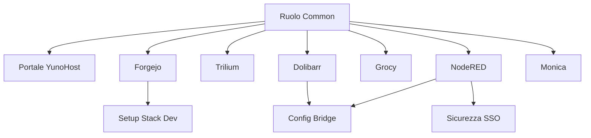

# Architettura Smart Bar Cortex

## Design Modulare

L'infrastruttura è costruita su **YunoHost 12 (Debian 12)** utilizzando un approccio Ansible modulare.

### Livelli (Layers)

1.  **Livello Hardware/OS**: 
    *   **Alpha**: VPS Fisico/Virtuale su Hetzner.
    *   **Test**: VM effimere.
    *   **Rete**: Headscale (VPN) Mesh + AdGuard Home (DNS).

2.  **Livello Applicativo (App YunoHost)**:
    *   Gestito via comandi `yunohost app install` "wrappati" in Ansible.
    *   **Idempotenza**: Tutti i task controllano l'output JSON di `yunohost app list` prima dell'esecuzione.

3.  **Livello Bridge (Integrazione)**:
    *   **Dolibarr -> Node-RED**: SQL Injection abilita `modWebhook` e configura l'endpoint.
    *   **Node-RED -> Telegram**: Pacchetti NPM installati nella directory utente.

4.  **Livello Personalizzazione**:
    *   **SSOWat (Portale)**: Manipolazione config JSON + Asset CSS custom.
    *   **Forgejo**: `app.ini` + Cartella asset pubblici.
    *   **Node-RED**: Sostituzione `settings.js`.

## Grafo delle Dipendenze

## Modello di Sicurezza

*   **Accesso Pubblico**: Ristretto di default via YunoHost SSO.
*   **API Node-RED**: Aperta esplicitamente al gruppo `visitors` via `yunohost permission` per la ricezione webhook.
*   **Git**: Repository privater, solo HTTPS.

## Controllo Accessi & Permessi

Gestiamo i permessi via `vars.yml` (`apps.<app>.access`) e il ruolo `sso_security`.

| Livello Accesso | Config `access` | Descrizione |
| :--- | :--- | :--- |
| **Privato (SSO)** | `private` | Default. Richiede login YunoHost. |
| **Pubblico (Web)** | `public` | Accessibile ai "Visitatori" (Nessun login). |
| **Solo VPN** | `public`* | *Se il dominio è `.lan`, "Pubblico" significa che qualsiasi dispositivo in VPN accede senza auth. |

> **Nota:** Il ruolo `sso_security` impone questi stati aggiungendo/rimuovendo il gruppo `visitors` dai permessi dell'app (`app.main`).
